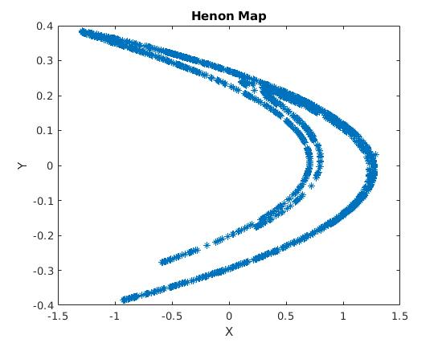
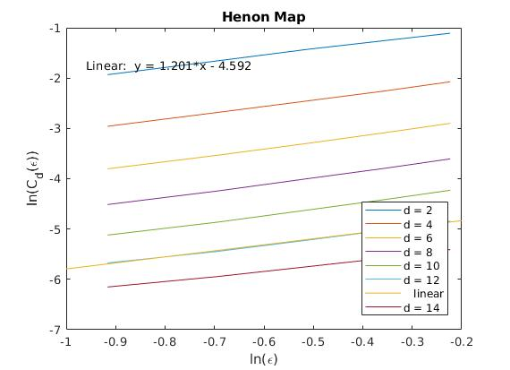
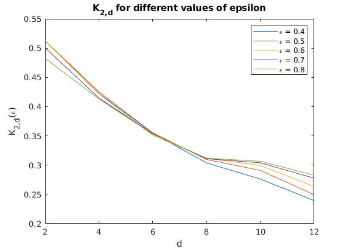

# K2
## Background
K2 is an approximation of Kolmogorov-Sinai (KS) Entropy developed by [Peter Grassberger and Itamar Procaccia in 1983](https://journals.aps.org/pra/pdf/10.1103/PhysRevA.28.2591). The significant contribution of this paper is that it provides a realitivly acurate approximation of KS entropy from a set of time series data. 

## Notes
 - `Cd.m` calculates the corrleation integral for a measure *d* and a box of size *epsilon*.
 - `K2.m` then calculates the correlation integral for a range of measures and box sizes which by examining the limit of their convergence the value of K2 may be derived. Further, from examing the slope of ln(Cd(epsilon)) vs ln(epsilon) the strange attractor characteristic, *v* may be derived.
 - `Henon.m` returns the time series of a Henon map.
 - `Example.m` shows an exmple applicaiton of calculating *K2* for the Henon Map.

## Henon Map Example
The Henon Map is a two dimensional chaotic map. An example is shown below.

From it we can calculate the correlation integral for a range of values for *d* and *epsilon* as shown below.

From either calculating the slope by hand or running a linear point fitting on the lines we can see that *v = 1.2* which is the same as in Grassberger's paper.

Then from calculating the K2 approximation, for progressivly higher measures *d*, we can find that *K2 ~ 0.3* which is correlated in Grassberger's paper.

